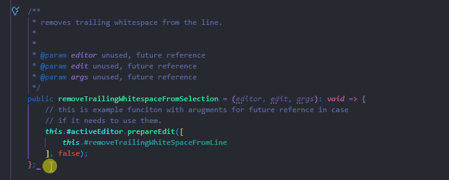
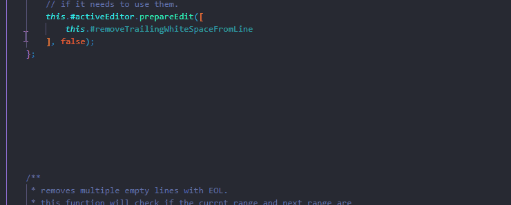
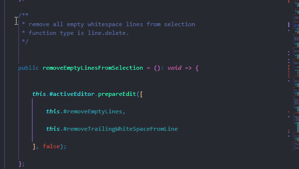
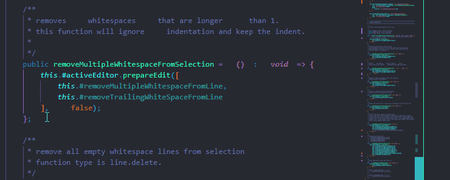
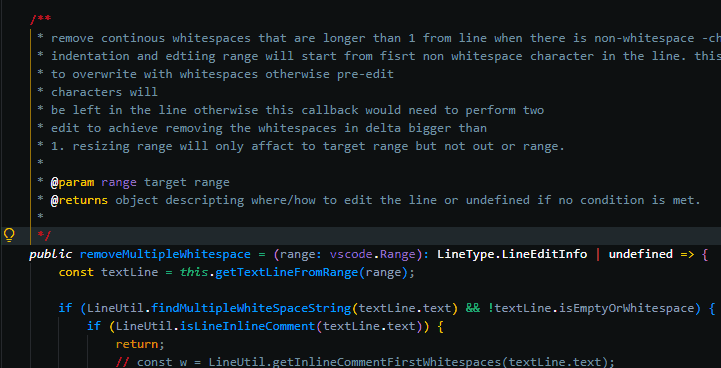
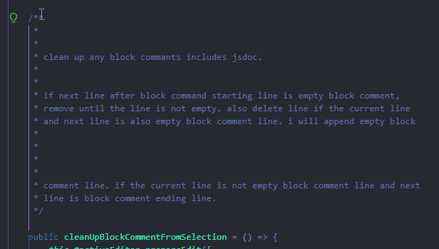
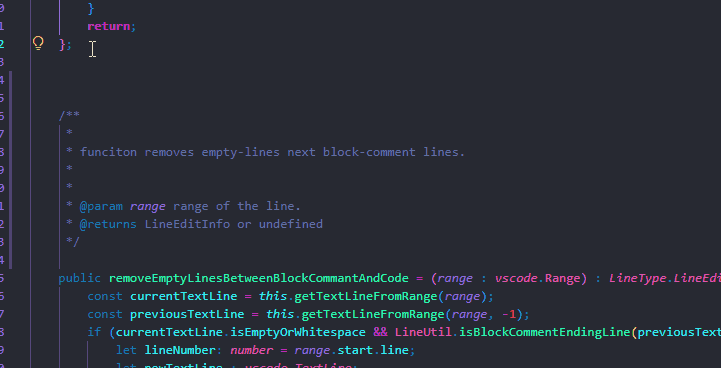
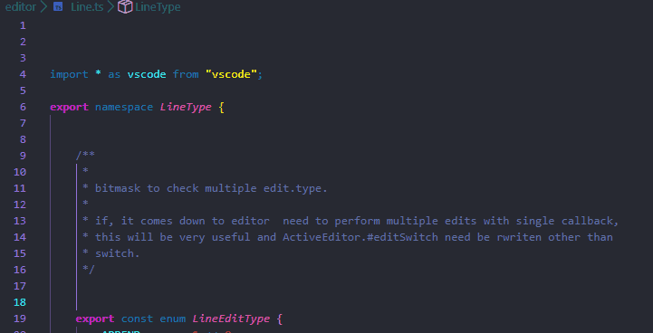

# Introduction

  

This is my rehab code and may not be fully complete.
i wanted a extension like this although a linter can do this sort of things but need non-language specific generic formatter.
I did not aim to make a functions which formatters can do already.

 

## Configurations

- autoSaveAfterEdit: enum[commandList:string] (default = "disabled")
- autoTriggerOnSave: default true boolean (default = true)
- addExtraLineAtEndOnBlockComment: boolean (default = false)
- deleteCommentAlsoDeleteBlockComment: boolean (default = false)
- blockCommentWordCountJustifyAlign: boolean (default = true)
- blockCommentCharacterBoundaryBaseLength: number (default = 70)
- blockCommentCharacterBoundaryTolanceLength: number (default = 5)
-

  

## Commands

Each command call has its functions as a class member functions. no functionality call overlap even it would seeems to.

> Command -> __removeDocumentStartingEmptyLine__ 

Shortcut key : __`not assigned`__ 

- Removes doucment starting empty-lines if document starting line is in selection.

************************************************************************************************************************************

> Command -> __removeTrailingWhitespaceFromSelection__ 

Shortcut key : __`ctrl + alt + w`__ 

- Removes trailing whitespaces from the lines in selection.

************************************************************************************************************************************

> Command -> __removeMulitpleEmptyLinesFromSelection__ 

Shortcut key : __`ctrl + alt + m`__ 

- Remove lines either empty or whitespace only in selection range but leaving 1 empty lines to keep the contents block.

************************************************************************************************************************************

> Command -> __removeEmptyLinesFromSelection__ 

Shortcut key : __`ctrl + alt + e`__ 

- Removes lines either empty or whitespace only in selection range.

************************************************************************************************************************************

> Command -> __removeMultipleWhitespaceFromSelection__ 

Shortcut key : __`ctrl + alt + space`__ 

- Removes whitespaces characters that are longer than size of 1. 
this command ignores indentation.

************************************************************************************************************************************

> Command -> __removeCommentedTextFromSelection__ 

Shortcut key : __`ctrl + alt + /`__ 

- Removes all comment only lines.

************************************************************************************************************************************

> Command -> __removeEmptyBlockCommentLineOnStart__ 

Shortcut key : __`not assigned`__ 

- Removes empty-block-comment-lines between block-comment-starting-line and non-empty-block-comment lines.

************************************************************************************************************************************

> Command -> __removeMultipleEmptyBlockCommentLine__ 

Shortcut key : __`not assigned`__ 

- Removes continuos empty-block-comment-lines.

************************************************************************************************************************************

> Command -> __insertEmptyBlockCommentLineOnEnd__ 

Shortcut key : __`not assigned`__ 

- Removes empty-whitespace-lines after block-comment-ending-line and non-empty whitespace-lines.

************************************************************************************************************************************

> Command -> __removeEmptyLinesBetweenBlockCommantAndCode__ 

Shortcut key : __`not assigned`__ 

- Insert empty-block-comment-lines before block-comment-ending-lines and non-empty-block-comment-lines.

************************************************************************************************************************************

> Command -> __blockCommentWordCountAutoLengthAlign__ 

Shortcut key : **`ctrl + alt + a`

- Auto adjust block-comment line length.

Related Configurations

- blockCommentCharacterBoundaryBaseLength (default 70) : Minimum Line length of block comment.
- blockCommentCharacterBoundaryTolanceLength (default 10) : Character count margin for the line.

************************************************************************************************************************************

> Command -> __printNowDateTimeOnSelection__ 

Shortcut key : __`ctrl + alt + n`__ 

- Print DateTime string on current position of the selection.

************************************************************************************************************************************

> Command -> __blockCommentWordCountJustifyAlign__ 

Shortcut key : __`ctrl + alt + a`__ 

- Read the line and count the length, trigger funciton if the character count is bigger than `config.blockCommentCharacterBoundaryBaseLength` + `config.blockCommentCharacterBoundaryTolanceLength`. if the character count is less, the function will concatinate next line words until it is bigger than `config.blockCommentCharacterBoundaryBaseLength` and will continue unitl the line is not empty-block-comment line.

 

## Commands group

Here are the list of commands that combined multiple commands.

> Command -> __cleanUBlockCommentCommand__ 

Shortcut key : __`ctrl + alt + b`__ 

- Removes empty-block-comment-lines between block-comment-starting-line and non-empty-block-comment lines.
- Removes continuos empty-block-comment-lines.
- Removes empty-whitespace-lines after block-comment-ending-line and non-empty whitespace-lines.
- Insert empty-block-comment-lines before block-comment-ending-lines and non-empty-block-comment-lines.
- blockCommentWordCountJustifyAlign

   

> Command -> __cleanUpCodeCommand__ 

Shortcut key : __`ctrl + alt + x`__ 

- Removes starting empty lines on document if the range is selected.
- Removes trailing whitespaces from selection.
- Removes Multiple whitespace-characters that are longer than length of 1.
- Removes multiple whitespace-lines that are more than 1 but keeping 1.
- blockCommentWordCountJustifyAlign

 

   

> Command -> __cleanUpDocumentCommand__ 

Shortcut key : __`ctrl + alt + c`__ 

- Removes empty-block-comment-lines between block-comment-starting-line and non-empty-block-comment lines.
- Removes continuos empty-block-comment-lines.
- Removes empty-whitespace-lines after block-comment-ending-line and non-empty whitespace-lines.
- Insert empty-block-comment-lines before block-comment-ending-lines and non-empty-block-comment-lines.
- Removes starting empty lines on document if the range is selected.
- Removes trailing whitespaces from selection.
- Removes Multiple whitespace-characters that are longer than length of 1.
- Removes multiple whitespace-lines that are more than 1 but keeping 1.
- blockCommentWordCountJustifyAlign

## backlog

- need better readme and relace old gif.
- should notify the user when the keybinding is already taken.
- Digest linter and perform auto correction based on lint config.
- removeCommentedLine improvement for trailing both previous line and next line.
- removeCommentedLine improvement to be ablet to delete block comment if it is in selection.

## changelog

version 0.9.2073

- cursor reset improvement. cursor no longer get put on random places after the line delete in all kinds of edit.

version 0.9.2061

- auto save trigger has been added for after command call with it's configuration.
- auto trigger command call before command call with it's configuration.
- new event class has been added.
- removeMultipleWhitespace function no longer remove multiple whitespaces on inline comment.
- extension icon added.

version 0.9.206

- code split on lineHandler.ts
- function improvement on blockCommentWordCountJustifyAlign
- blockCommentCharacterBoundaryTolanceLength default value to 5

version 0.9.2051

- readme improvement
- added new extension configuration `deleteCommentAlsoDeleteBlockComment`